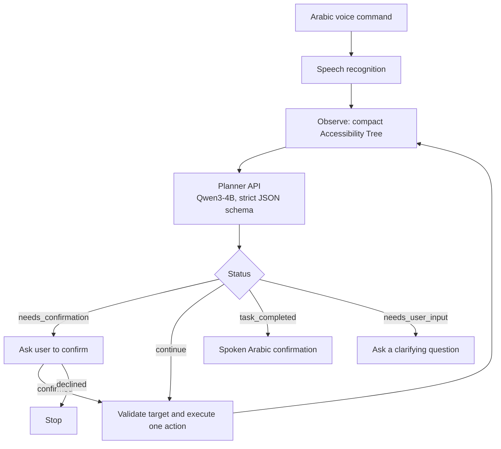

# FAHIM

**Framework for Arabic Human-centered Interaction on Mobile.** FAHIM is an Android accessibility assistant that lets blind and visually impaired users complete multi-step phone tasks by speaking a goal in Arabic, instead of navigating the screen one element at a time.

> Capstone project, KAUST Artificial Intelligence Program (2026).

---

## The problem

Screen readers such as TalkBack are passive: the user moves through interface elements one by one. Unfamiliar multi-step tasks, such as searching inside an app or reaching a settings page, become slow and mentally demanding. FAHIM turns this into goal-oriented interaction: say what you want, and the assistant operates the interface while telling you what it is doing.

## How it works

FAHIM runs an iterative **observe → plan → act** loop between a Kotlin Android client and a self-hosted planner.



### Android client (Kotlin, Jetpack Compose)

| Module | Role | Code |
| --- | --- | --- |
| Perception | Captures the Accessibility Tree and compresses it into actionable targets with screen-scoped IDs | `agent/perception/` |
| Planner contract | Sends the goal, current app, UI state, context, last result and action history; parses the decision | `agent/contract/`, `PlannerClient.kt` |
| Validation and safety | Rejects stale, missing or invented targets; enforces allowed apps and confirmation for consequential actions | `agent/validation/`, `agent/safety/` |
| Execution | Performs exactly one action per step through Accessibility Services, then waits for the UI to settle | `agent/execution/` |
| Agent loop | Runs the cycle with loop protection, snapshot freshness checks and an emergency stop | `agent/loop/` |
| Voice | Android speech recognition, an on-device Whisper option via JNI, and Arabic text-to-speech feedback | `GoogleSpeechRecognizerController.kt`, `WhisperEngine.kt` |

### Planner server (Python)

- **Model:** Qwen3-4B-Instruct-2507, quantized (Q4_K_M), served with llama.cpp's OpenAI-compatible server.
- **API:** a FastAPI gateway (`api_gateway.py`) wraps the model behind `POST /api/v1/predict`.
- **Constrained output:** the model must answer with a strict JSON schema covering 6 statuses and 9 actions (`open_app`, `tap`, `type`, `scroll`, `back`, `read_aloud`, `ask_user`, `confirm_with_user`, `none`), at temperature 0.
- **Prompting:** the versioned system prompt lives in `decision_engine_system_prompt_v3_3.md`.
- **Model selection:** several Qwen3 and Qwen3.5 variants and prompt versions were benchmarked; results are in `VoiceAgent_Decision_Engine_Final/`.

## Results

Live-device evaluation on Android 12 with an Arabic locale:

| Scenario | Success | Avg. time | Avg. steps |
| --- | --- | --- | --- |
| Launch YouTube | 3/3 | 10 s | 3 |
| Set a five-minute timer | 1/3 | 15 s | 4 |
| Search in YouTube | 3/3 | 20 s | 5 |
| Navigate to Wi-Fi settings | 2/3 | 16 s | 4 |
| Search WhatsApp for a contact | 1/1 | 20 s | 5 |
| Type a message without sending | 2/2 | 15 s | 4 |
| **Total** | **12/15 (80%)** | **16.0 s** | **4.2** |

An earlier baseline completed 2 of 8 tasks (25%) at about 52.5 s per task. The two evaluations used different scenario sets, so they are descriptive rather than a controlled comparison. The planner server passes all **80 regression tests**.

A trial counts as successful only when the requested end state is reached; executing individual actions is not enough.

## Limitations

- Evaluated on a single device; system-settings tasks are still fragile.
- The confirmation flow needs a dedicated safety test suite (sending, calls, deletion, purchases).
- Not yet tested with Arabic-speaking blind and visually impaired users.

## Getting started

### 1. Planner server

```bash
# Serve the model with llama.cpp on port 8080
llama-server -m Qwen3-4B-Instruct-2507-Q4_K_M.gguf --port 8080

# Run the API gateway on port 8000
pip install fastapi uvicorn requests pydantic
python api_gateway.py
```

Expose port 8000 to the phone (same network or a tunnel such as ngrok).

### 2. Android client

1. Open the project in Android Studio (min SDK 26).
2. Set `PLANNER_ENDPOINT` in `app/src/main/java/com/example/testandroidenv/DemoConfig.kt` to your planner URL.
3. Build and install:

```bash
./gradlew :app:assembleDebug
```

4. On the phone, enable FAHIM under **Settings → Accessibility**.

### 3. Planner evaluation

```bash
python eval_runner_v3.py \
  --episodes planner_fixtures_v3.jsonl \
  --model-name Qwen3-4B-Instruct-2507 \
  --url http://127.0.0.1:8080/v1/chat/completions \
  --system-prompt decision_engine_system_prompt_v3_3.md
```

## Team

Nawaf bin Jurayyan, Ammar Abdulrahman, Khaled Alshahry and Abdulaziz Khamis, supervised by Dr. Muhammad Mubashar.
